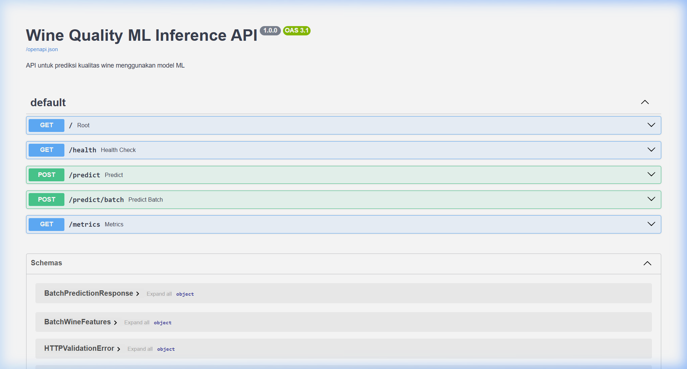
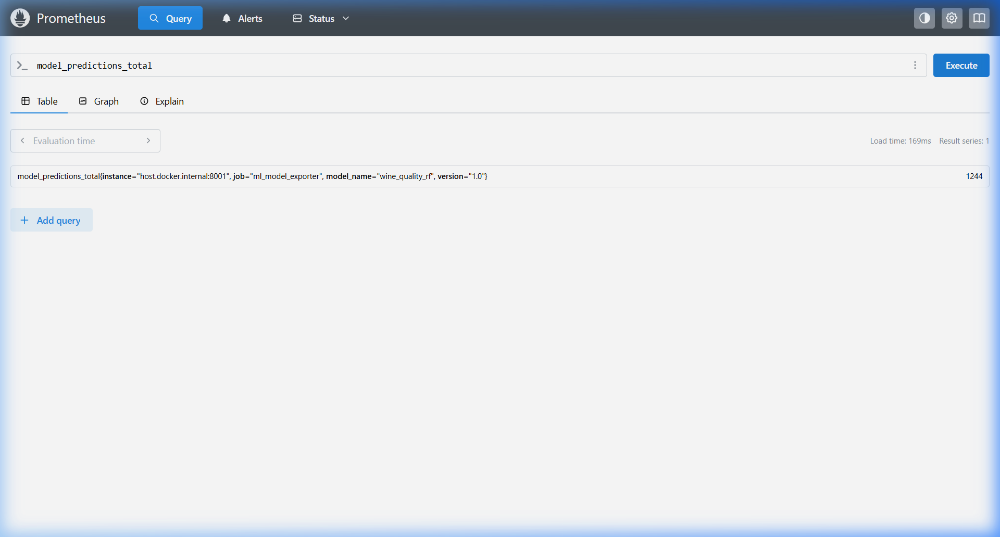
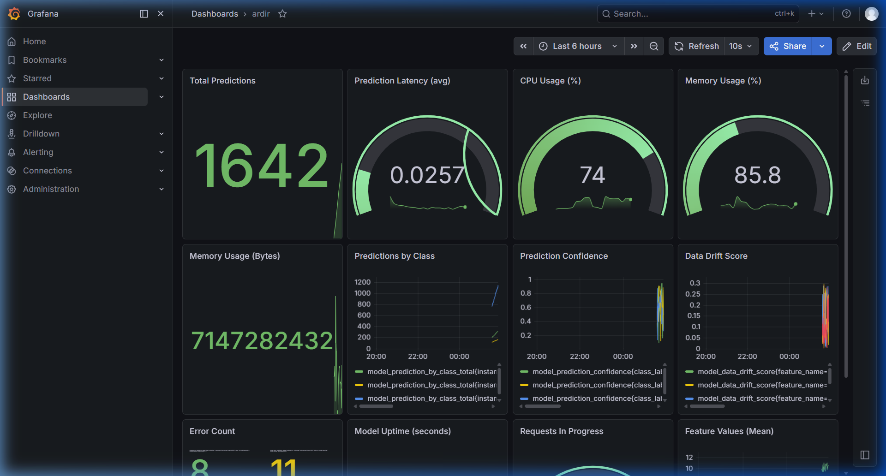
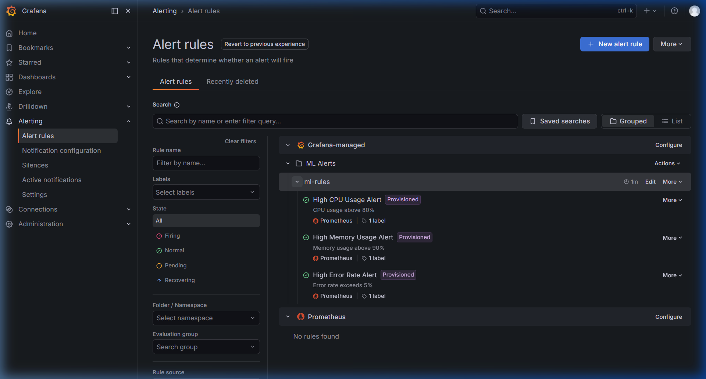

# Sistem Monitoring dan Logging - Wine Quality MLOps

## Deskripsi
Repository ini berisi sistem monitoring dan logging untuk model Wine Quality ML menggunakan Prometheus dan Grafana.

## Struktur
```
+-- prometheus.yml             # Konfigurasi Prometheus
+-- prometheus_exporter.py     # Custom metrics exporter (12 metrics)
+-- Inference.py               # Script inference dengan monitoring
+-- Dockerfile                 # Dockerfile model serving
+-- Dockerfile.exporter        # Dockerfile exporter
+-- docker-compose.yml         # Docker Compose stack
+-- bukti_serving/             # Bukti model serving API
+-- bukti_monitoring_prometheus/ # Bukti monitoring Prometheus (5 metrics)
+-- bukti_monitoring_grafana/  # Bukti monitoring Grafana (12 metrics)
+-- bukti_alerting_grafana/    # Bukti alerting rules Grafana
```

## Custom Metrics (12 Total)
1. predictions_total
2. prediction_latency
3. cpu_usage
4. memory_usage
5. memory_bytes
6. predictions_by_class
7. prediction_confidence
8. data_drift
9. error_count
10. uptime
11. requests_in_progress
12. feature_values

## Cara Menjalankan
```bash
docker-compose up -d
```

## Stack
- **Model Serving**: MLflow + Flask
- **Metrics**: Prometheus + Custom Exporter
- **Dashboard**: Grafana (12 panels)
- **Alerting**: Grafana Alert Rules

## Bukti Screenshots
### Model Serving


### Prometheus Monitoring


### Grafana Dashboard


### Alerting Rules

